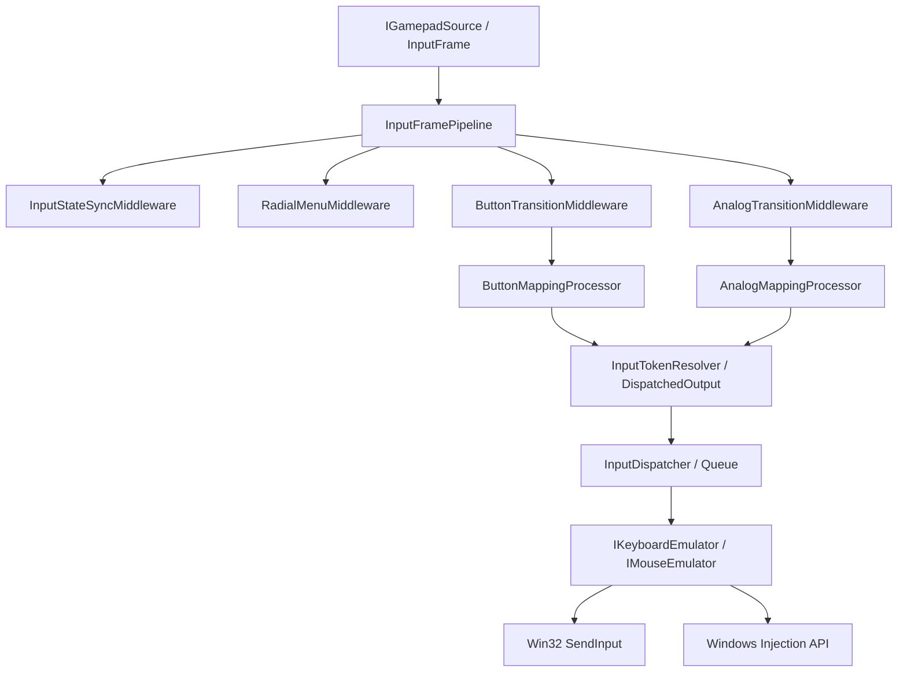

# Input Pipeline Architecture

This document describes the flow of data from gamepad input to keyboard/mouse emulation.

## Data Flow Overview

## Layers

### 1. Input Source (`IGamepadSource`)
Produces `InputFrame` objects at a high frequency (e.g., 100Hz+). Each frame contains the current state of all buttons, triggers, and thumbsticks.

### 2. Pipeline Middleware (`IInputFrameMiddleware`)
Processes the `InputFrame` through a series of stages:
- **State Sync:** Updates internal trackers with the latest raw values.
- **Radial Menu:** Intercepts thumbstick movement if a radial menu is active.
- **Button Transitions:** Detects Pressed/Released edges for digital buttons.
- **Analog Transitions:** Detects threshold crossings for triggers and thumbsticks.

### 3. Mapping Processors
- **`ButtonMappingProcessor`:** Handles hold sessions, chords, and multi-tap logic.
- **`AnalogMappingProcessor`:** Maps analog values to digital outputs (e.g., Trigger -> Key) or continuous movement (Thumbstick -> Mouse).

### 4. Resolution (`InputTokenResolver`)
Converts profile strings (e.g., "Space", "MouseLeft") into logical `DispatchedOutput` objects.

### 5. Dispatcher (`InputDispatcher`)
A thread-safe queue that ensures outputs are sent in the correct order. It manages the background worker thread that performs the actual emulation, preventing the input loop from blocking on timing-sensitive operations (like 30ms key taps).

### 6. Emulation Backends (`IKeyboardEmulator`, `IMouseEmulator`)
The final "edge" of the system.
- **Win32:** Uses `SendInput` with ScanCodes.
- **Injection:** Uses `Windows.UI.Input.Preview.Injection`.

Both backends implement a unified `Execute(OutputCommand)` contract to ensure consistent behavior regardless of the chosen API.
